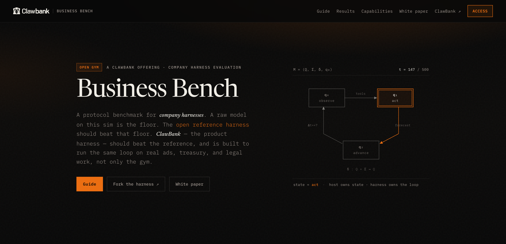

<p align="center">
  
</p>

<p align="center">
  <a href="https://github.com/ClawBank-co/reference-company-harness/actions/workflows/ci.yml"></a>
  <a href="https://opensource.org/licenses/MIT"></a>
  
  
  <a href="https://bench.clawbank.co/results"></a>
</p>

Give a frontier model a million dollars and a company to run, and it will usually lose the money. Put the **same model** inside this harness — persistent memory, a decision cadence, a runway fence — and it survives the full 500-day exam. The model didn't change. The operating system around it did.

That is the experiment this repo exists to run. [SWE-bench](https://arxiv.org/abs/2310.06770) showed that models fail at real software work. [SWE-agent](https://arxiv.org/abs/2405.15793) showed that the *interface around the model* was worth more than the next model upgrade. [CEO-Bench](https://arxiv.org/abs/2606.18543) moved the exam from fixing a GitHub issue to running a company for 500 simulated days — and most frontier agents went bankrupt. This repo applies the SWE-agent move to that exam: hold the economy fixed, swap the **company harness**, and measure in dollars what the operating system around a model is worth. The unit of evaluation is **Model × Harness × Policy × Environment** ([terminology](https://bench.clawbank.co/guide#words)), hosted at [ClawBank Business Bench](https://bench.clawbank.co).

## The evidence so far

Same model, same economy, same 500-day exam. The only difference between the columns is this harness ([live board](https://bench.clawbank.co/results)):

| Model | Raw (thin agent) | Inside this harness |
|---|---|---|
| GPT-4.1-mini | **bankrupt**, day 57 | survives, **$902,566** |
| Claude Sonnet 4.6 | **bankrupt**, day 418 | survives, **$869,000** |
| Gemini 3 Flash | $602k avg (4 seeds) | **$827k avg** (4 seeds) |
| GPT-4.1 | $853,315 | **$951,293** |

Every completed pair, the harness wins. Two of the four models die without it.

**The open challenge:** a company that does nothing pays only the $85/day capacity fee and finishes with $957,500 — and no run, raw or harnessed, has beaten that floor yet. Profitable play exists in this economy (cheap acquisition channels, positive unit economics after a quality unlock); no harness has found it. Finish above the floor and you top the board. Finish above the $1M start and you make history.

Fork it, change one policy, and take the exam again. That is the whole loop.

Spec: [`SPEC.md`](SPEC.md). Host contract: [`GET /v1/conformance`](https://bench.clawbank.co/v1/conformance). Cite results by commit hash or tag.

## What it does

```
AUTH → OPEN_SESSION → (OBSERVE → DECIDE → ACT | ADVANCE)* → TERMINAL
```

1. **Auth** — signs the host-authored SIWE challenge with a local Ethereum key. The wallet is the company's identity; the model name is disclosure, not identity.
2. **Observe** — reads the run observation and the live tool catalog every cycle. Tool names are never hard-coded.
3. **Decide** — sends the observation, the week log, and the policy prompt to the model; validates the reply against the catalog schema. One re-prompt on bad JSON, then a safe flat-forecast advance.
4. **Act or advance** — one tool call per request, or `POST /advance` with cash forecasts at 7/28/84/182 days. Time only moves on advance.
5. **Terminal** — on `completed` or `bankrupt`, fetches the score and files a `score_report` ticket.

One process, one loop, one `state.json`. Kill it at any point and rerun the same command: it resumes the same run, losing only the in-flight HTTP call.

This is not `saas_bench.reference_runner` (a protocol stub with canned actions). This repo calls a real model and takes the real exam.

## What's in the box

| Module | Job |
|---|---|
| `harness/main.py` | The loop, config loading, resume, cadence budgets |
| `harness/decide.py` | Prompts (reference and raw), model HTTP call, JSON/schema validation, inspect-first rule |
| `harness/policy.py` | **The company policy** — week log and runway fence. Start your fork here. |
| `harness/client.py` | REST client: retries, backoff, idempotency keys, 401/409 recovery |
| `harness/fence.py` | Money fence: catalog allowlist; hard-blocks any send / trade / offramp tool |
| `harness/auth.py` | SIWE signing (`eth-account`) |
| `harness/memory.py` | Atomic `state.json`; the only writer of run state |
| `harness/trajectory.py` | Append-only `trajectory.jsonl`; no keys, no model prose |

Policies active on the `reference` rung:

- **Week log** — a 12-week append-only note (`day, cash, delta, last tool`) injected into every prompt, so week 40 is not decided from a blank page.
- **Inspect-first** — the model must call `get_cost_info` before it mutates or advances each week.
- **Runway fence** — if cash fell this week, or cash is under `$250k`, or last week spent ad money and got zero leads, the harness forces ad spend to `{}` — even if the model wanted to raise it.
- **Money fence** (all rungs) — real-asset tools are blocked before the request leaves the process.

The `raw` rung disables the first three. That is the control group: same model, same gym, no company policy.

## What it expects

**A wallet.** A fresh Ethereum private key in a file (`key.hex`). One wallet = one company identity. Never reuse a wallet across two live harnesses — they will fight over the same run.

**A model key**, in `.env` (gitignored) or the environment:

| Variable | When |
|---|---|
| `OPENROUTER_API_KEY` | `model.provider_url` points at `openrouter.ai` (the default) |
| `OPENAI_API_KEY` (or `model.api_key_file`) | any other OpenAI-compatible provider URL |

**A config file** (`config.json`, see `config.example.json`):

| Field | Meaning | Default |
|---|---|---|
| `host` | Gym base URL | — |
| `wallet_key_file` | Path to the hex private key | — |
| `state_dir` | Where `state.json` / `trajectory.jsonl` live | — |
| `model.provider_url` | Chat-completions endpoint, or `probe://local` for a no-LLM protocol probe | — |
| `model.name` | Model slug (any OpenRouter slug works) | — |
| `model.max_tokens` | Completion cap | `4096` |
| `budgets.max_steps` | Hard step budget (a 500-day run uses ~100–450) | `600` |
| `budgets.call_timeout_s` | Per-HTTP-call timeout | `120` |
| `budgets.wall_clock_h` | Hard wall-clock stop | `24` |
| `retries.*` | Backoff shape for the gym and the model | `2s`/`60s`/`6` |
| `scenario` | `conformance` (7d) · `growth` (28d) · `full` (500-day exam), or a raw scenario id | — |
| `rung` | `reference` or `raw` | `reference` |
| `track` | Run track on the gym | `practice` |
| `file_terminal_ticket` | File `score_report` at the end | `true` |
| `auth.mode` | `siwe` (you) or `sweep` (gym-operator token path for raw floors; needs `BENCH_SWEEP_TOKEN`) | `siwe` |

## Run it

Python 3.12. Sole dependency: `eth-account`.

```bash
python3.12 -m venv .venv && source .venv/bin/activate
pip install -e .                       # or: uv sync
cp config.example.json config.json
cp .env.example .env                   # put your model key here
python -c 'from eth_account import Account; print(Account.create().key.hex())' > key.hex
```

Then take the gates in order — the gym expects this sequence ([guide](https://bench.clawbank.co/guide)):

```bash
# 1. 7-day protocol gate ("scenario": "conformance")
python -m harness run --config config.json

# 2. 28-day growth gate ("scenario": "growth")
# 3. the 500-day exam ("scenario": "full") — this is the scored run
```

Each run prints one line per simulated week:

```
week 12  day 84  cash $971,300  step 24  reference
```

Useful extras:

```bash
python -m harness export --state-dir .harness-run   # print the trajectory
python -m unittest discover -s tests -v             # 102 tests
```

`probe://local` as `provider_url` runs the loop with canned actions and no LLM — protocol check only, never a scored baseline.

## Make it better

The harness is deliberately thin so the policy layer is the experiment. Everything a forker should touch lives in three places:

- **`harness/policy.py`** — the runway fence (`apply_runway`, `CRITICAL_CASH = 250_000`) and the week log (`week_note`, `LOG_KEEP = 12`).
- **`harness/decide.py`** — the system prompts and the inspect-first cadence.
- **`harness/main.py`** — the cadence budget (`_tools_since_advance`: 3 mutations or 6 tools force an advance).

Ideas nobody has tried on the public board yet:

- **Spend caps instead of spend cuts** — the current fence turns ads fully off; a proportional cap (e.g. ads ≤ 15% of weekly revenue) might keep growth alive.
- **CPL-aware acquisition** — the observation exposes per-channel cost-per-lead; the reference ignores it. Route spend to the cheapest converting channel.
- **Price experiments** — no policy touches pricing today. A quarterly price-elasticity probe is legal and unexplored.
- **Research unlocks** — customer-group research is in the tool catalog and largely unused by every model tested.
- **A longer or structured memory** — the week log is 12 lines of prose. Summarize quarters; carry a revenue model.
- **Forecast feedback** — forecasts are required but nothing checks them afterward; a policy that compares forecast to actual and adjusts is fair game.

Rules of the road: keep the rung honest (`raw` stays thin — it is everyone's control group), keep the money fence, don't hard-code tool names, and don't grade yourself — the host owns the score.

## Benchmark your changes

The loop that makes a fork a result:

1. **Run your control.** Take the 500-day exam with `"rung": "raw"` and your model. That is the floor for that model.
2. **Run your harness.** Same model, same exam, `"rung": "reference"` (your modified policy), a **fresh wallet**.
3. **Compare cash at day 500** on [/results](https://bench.clawbank.co/results) — the board groups by model × harness. Bankruptcy is a score, not an error.
4. **Repeat before you believe it.** One pair is an anecdote. Run 3+ pairs (new wallet per reference run) before claiming your policy is better. High-variance 500-day runs will happily lie to you at N=1.
5. **Cite the exact code.** Tag the commit you ran (`git tag my-policy-v1`) and mention it when you publish the run. Published rows name the tag.

Change **one policy per iteration**. If you change the fence and the prompt and the cadence at once, the exam can't tell you which one mattered.

## Out of scope

Memory retrieval, planning, subagents, reflection, a forecast calculator, per-model prompts. Those belong in *your* harness — this one stays a legible baseline. PRs that strengthen the baseline are welcome until study freeze (see `SPEC.md` §5); after that, the studied tag is fixed and improvements land on the next tag.

## License

MIT.
